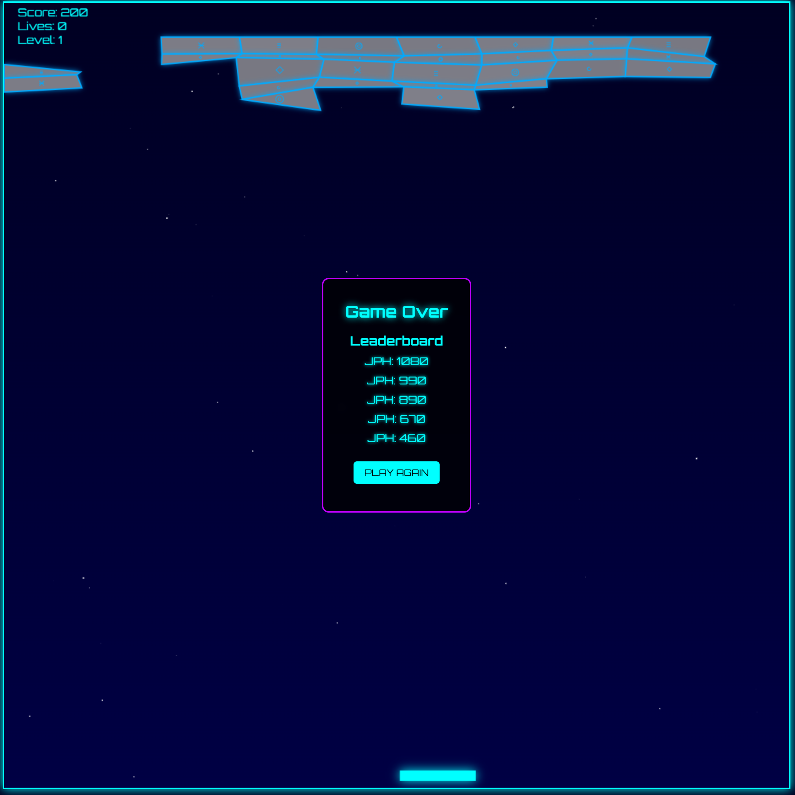

# Sci-Fi Breakout

A modern, sci-fi themed twist on the classic Breakout arcade game, featuring Sacsayhuamán-inspired megalithic brick patterns, dynamic ball physics, and exciting power-ups.


*Note: Add a screenshot of your game here. Create a "screenshots" folder and add your game screenshot there.*

## 🎮 Game Overview

Sci-Fi Breakout reimagines the classic brick-breaking formula with a futuristic sci-fi aesthetic. The game features interlocking megalithic brick patterns inspired by ancient Incan architecture at Sacsayhuamán, combined with glowing energy seams and sci-fi textures to create a unique visual experience.

## 🕹️ How to Play

1. Move your mouse left and right to control the paddle
2. Bounce the ball off the paddle to break the bricks
3. Destroy all bricks to advance to the next level
4. Each level features a different megalithic brick pattern
5. Collect power-ups to enhance your gameplay
6. Don't let the ball fall off the bottom of the screen!

## 📋 Game Rules

- **Starting Lives**: 4
- **Levels**: 4 unique level designs that repeat with increasing difficulty
- **Scoring**:
  - Standard Brick: 10 points
  - Power-Up Brick: 15 points
  - Collecting Power-Up: 100 points
  - Completing a Level: 500 points

## ✨ Features

### Unique Megalithic Brick Patterns
Each level features a different Sacsayhuamán-inspired interlocking brick pattern:
- **Level 1**: UFO/Spaceship formation with blue energy seams
- **Level 2**: Alien glyph patterns with green energy seams
- **Level 3**: Cosmic nebula design with purple energy seams
- **Level 4**: Futuristic circuit layout with yellow energy seams

### Power-Ups
Collect these power-ups to gain special abilities:

- **Wide Paddle** (Green): Increases paddle width for 12 seconds
- **Multi-Ball** (Red): Adds two additional balls to the game
- **Slow Ball** (Blue): Reduces ball speed and increases ball size for 8 seconds

### Enhanced Physics
- Intelligent ball physics prevent frustrating side-to-side bouncing
- Ball angles are calculated based on where it hits the paddle
- Ball speed is carefully balanced to maintain challenge without frustration
- Visual trail effects add to the sci-fi atmosphere

## 🖥️ Technical Details

- Built with HTML5 Canvas and JavaScript
- Flask backend for serving the game and storing high scores
- Responsive design adapts to different screen sizes
- Dynamic sound effects enhance the gaming experience

## 🚀 Running the Game

1. Clone this repository
2. Install dependencies:
   ```
   pip install flask
   ```
3. Run the server:
   ```
   python app.py
   ```
4. Open your browser to http://localhost:5000

## 🎨 Credits

Developed as a modern reimagining of the classic Breakout game, with visual inspiration from the incredible megalithic stonework at Sacsayhuamán, Peru.

## 👾 Future Enhancements

- Additional power-up types
- Boss levels with special mechanics
- Online leaderboard
- Mobile touch controls
